# Introduction
Classical Semi-Supervised Learning (SSL) algorithms usually only perform well when all samples come from the same distribution. To apply SSL techniques to wider applications, there is an urgent need to study robust SSL methods that do not suffer severe performance degradation when unlabeled data are inconsistent with labeled data. However, research on robust SSL is still not mature enough and in confusing. Previous research on robust SSL has approached the problem from a static perspective, thereby conflating local adaptability with global robustness from a static perspective. 

We have corrected the misconceptions in previous research on robust SSL and reshaped the research framework of robust SSL by introducing new analytical methods and associated evaluation metrics from a dynamic perspective. We build a benchmark that encompasses three types of open environments: inconsistent data distributions, inconsistent label spaces, and inconsistent feature spaces to assess the performance of widely used statistical and deep SSL algorithms with tabular, image, and text datasets. 

This benchmark is open and continuously updated. To avoid unnecessary disputes, please understand that due to limited computational resources, the current evaluation scope is limited and cannot fully represent the performance of SSL algorithms in real-world applications. We welcome everyone to contribute additional experimental setups, codes, and results to improve this benchmark.

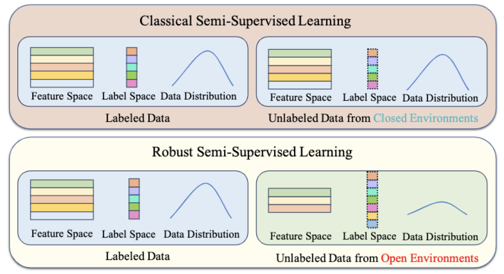

# Analytical Method
Studying the robustness of algorithms requires a dynamic perspective to investigate the change in algorithm performance with varying degrees of data inconsistency. we denote the degree of inconsistency between labeled and unlabeled data as t and describe robustness as the overall adaptability of an algorithm or model to all degrees of inconsistency t. We denote the function that describes the change in model accuracy with inconsistency as $Acc_T$. We plot the function $Acc_T(t)$ and refer to it as the Robustness Analysis Curve (RAC), which is used to analyze the robustness of performance with respect to the changes in the degree of inconsistency t. The RAC represents the correspondence between the inconsistency $t$ on the horizontal axis and the corresponding $Acc_T(t)$ on the vertical axis. For example:

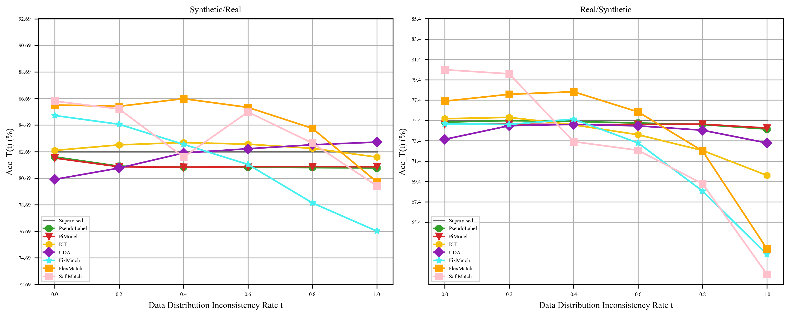

# Metrics
In order to provide a more comprehensive evaluation of SSL algorithms, we have defined multiple evaluation metrics to assess the robustness of these algorithms as unlabeled data varies. Unlike previous classical SSL evaluations that only assess $Acc_T(0)$ and previous robust SSL evaluations that only assess $Acc_T(t)$ for a specific t, our established evaluation framework based on RAC can reflect the global robustness.

- Area Under the Curve (AUC): RAC represents the performance variation with the degree of inconsistency. Therefore, the area under RAC reflects the overall performance of an algorithm or model under different degrees of inconsistency, considering each level of inconsistency equally important.

$$AUC(Acc_T) =\int_0^1 Acc_T(t)dt$$

- Expected Accuracy (EA): In many scenarios, due to the varying probabilities of different inconsistency levels t, we cannot assume that different t values are equally important. Therefore, we extend the AUC to the expected accuracy when t follows a distribution $P_T(t)$. EA is equivalent to the inner product of functions $Acc_T$ and $P_T$.AUC is a special case of EA

$$EA(P_T,Acc_T) = \langle P_T,Acc_T\rangle=\int_0^1 P_T(t)Acc_T(t)dt$$

- Worst-case Accuracy (WA): In robust SSL, we aim for the model to perform reasonably well even in the worst-case scenarios. This can be seen as a maximization of the minimum performance, which leads us to define WA to reflect the algorithm's performance under the worst conditions.

$$WA(Acc_T)=\min_{t\in[0,1]} Acc_T(t)$$

- Expected Variation Magnitude (EVM): In robust SSL, we aim for algorithms to maintain relatively stable performance across different levels of inconsistency. Therefore, we define EVM to measure the average magnitude of performance changes. This metric helps assess the average change in algorithm performance across varying levels of inconsistency. In the formula, $Acc_T'$ represents the derivative of $Acc_T$.

$$EVM(Acc_T) =\int_0^1 |Acc_T'(t)|dt$$

- Variation Stability (VS): To measure the stability of change in performance, we define VS to assess how steadily the accuracy changes with $t$. VS, in fact, is the variance of the first derivative of $ACC_T$. The higher the VS, the more random the trend of change.

$$VS(Acc_T)=\int_0^1 [Acc_T'(t)-(\int_0^1Acc_T'(t)dt)]^2dt$$

- Robust Correlation Coefficient (RCC): We not only pay attention to the magnitude of performance changes with inconsistency but also care about the direction of these changes. To address this, we define a metric called RCC, which represents the Pearson Correlation Coefficient  between accuracy and inconsistency $t$.

$$RCC(Acc_T)=\frac{\int_0^1 Acc_T(t)\cdot t dt - \int_0^1 Acc_T(t) dt}{\sqrt{\int_0^1 t^2dt -1}\cdot\sqrt{\int_0^1 Acc_T^2(t)dt-(\int_0^1 Acc_T(t) dt)^2}}$$

Overall, in open environments, we analyze RAC to reflect the performance of an algorithm or model as the inconsistency between unlabeled and labeled data changes. EA and its special case AUC reflect the overall performance. WA reflects the worst-case performance. EVM reflects the magnitude of performance variation. VS reflects the stability of the performance variation. RCC reflects the overall trend of performance variation. These metrics are all defined based on accuracy and can be extended to other different metrics by replacing the function $Acc_T$ and following the same procedure of plotting the curve and calculating the metrics according to the respective formulas.

# Installation
You can create the environment directly by anaconda.

```
conda env create -f environment.yaml
```

You can install the Benchmark by git.

```
https://github.com/YGZWQZD/Robust-SSL-Benchmark.git
```

# Algorithms Used for Evaluation

The used algorithms are continuously updating.

## Statistical Semi-Supervised Learning Algorithms

- Semi-Supervised Gaussian Mixture Model (SSGMM)

- TSVM

- Label Propagation

- Label Spreading

- Tri-Training

- Assemble

## Deep Semi-Supervised Learning Algorithms

- Pseudo Label

- PiModel

- MeanTeacher

- ICT

- UDA

- FixMatch

- FlexMatch

- SoftMatch

## Baseline Model
For statistical learning with tabular data:

- XGBoost

For deep learning with tabular data:

- FT-Transformer

For deep learning with Image data:

- ResNet50

For deep learning with Text data:

- Roberta

# Benchmark Results
The results are continuously updating.

We plotted the RAC and performed statistical analysis on various evaluation metrics for different methods. For the plotting of the RAC curve, we sampled 6 t values [0, 0.2, 0.4, 0.6, 0.8, 1] for all open environments. To ensure reliability, we conducted three experiments for each sampling point with seed values of $0\sim2$. The average of these experiments was used to plot the curve. Linear interpolation was performed between adjacent sampling points.

## Inconsistent Data Distributions
We set $t$ as the inconsistency rate between the distributions of labeled and unlabeled data. 

### Tabular Data
For tabular data, we evaluated all statistical SSL algorithms and deep SSL algorithms on the iris, wine, and letter datasets. Additionally, we evaluated all deep SSL algorithms on the larger dataset covertype. We calculated the centroids of each class in the data and used the distance between samples and class centroids to filter samples, thus constructing an environment with inconsistent data distribution. 

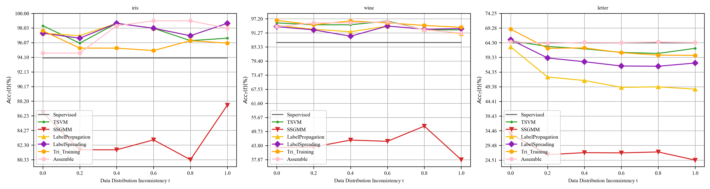

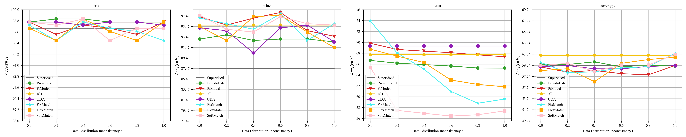

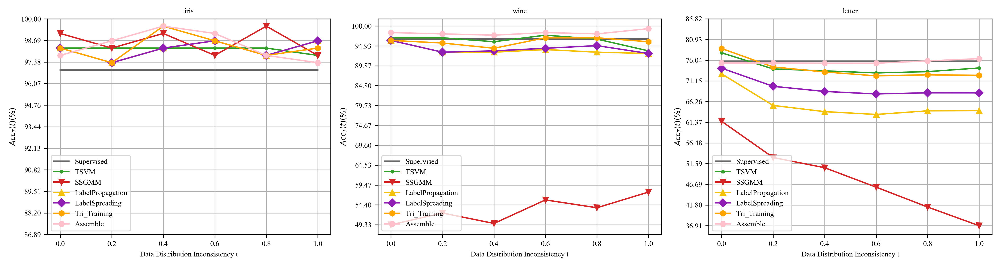

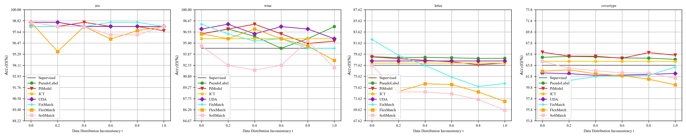

### Image Data
For image data, we directly used the Image-CLEF and VisDA datasets, which are commonly used in the field of transfer learning, to create environments with disparate distributions.

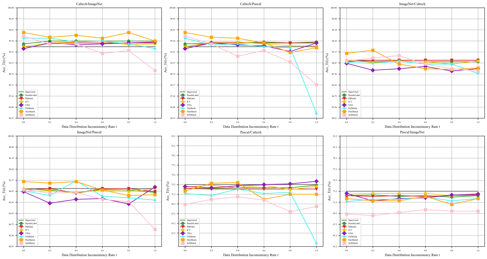


### Text Data
For text data, we utilized the Amazon reviews and IMDB movie reviews datasets, which have different distributions in sentiment classification, to construct environments with inconsistent distributions.

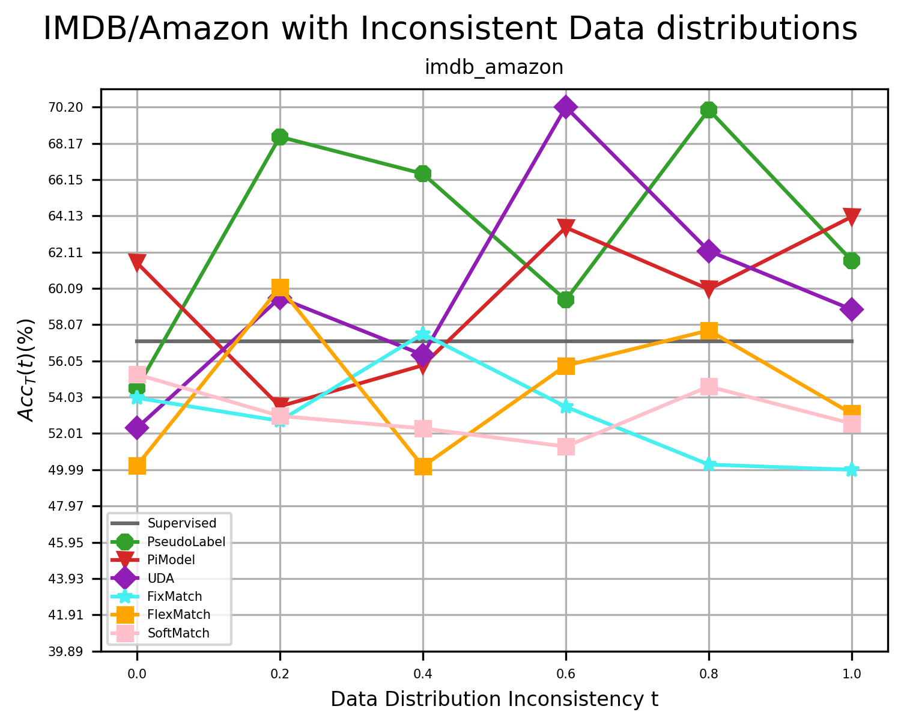

## Inconsistent Feature Spaces
We set $t$ as the inconsistency rate between the feature spaces of labeled and unlabeled data.

### Tabular Data
For tabular data, we used datasets that are consistent with the environment of inconsistent distribution. However, we introduced feature space inconsistency by randomly masking features. Each masked portion was filled with the mean value of the labeled data.

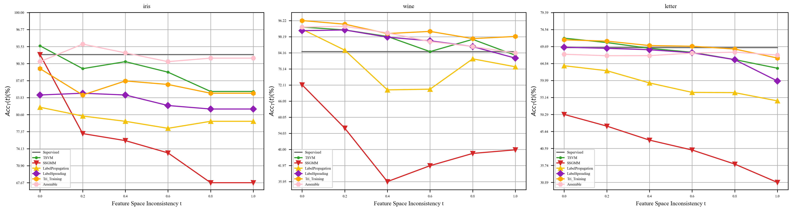

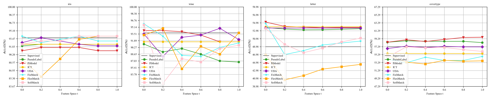

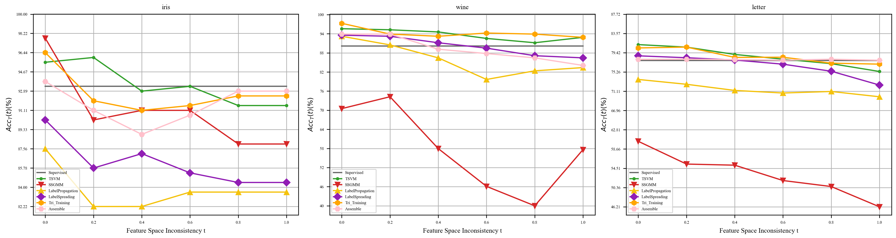

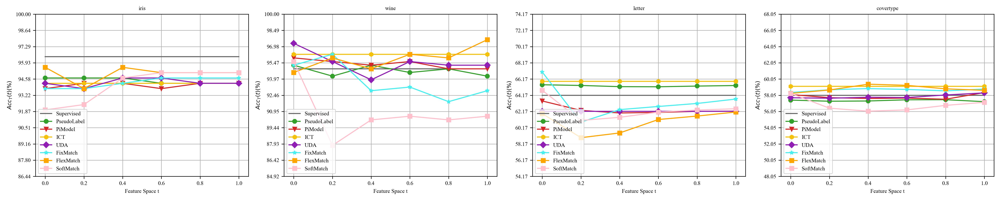

### Image Data
For image data, we used the CIFAR10 and CIFAR100 datasets. To create an environment with inconsistent feature space, we converted the images to grayscale, resulting in the loss of two color channels. The missing channels were filled with the preserved channel.

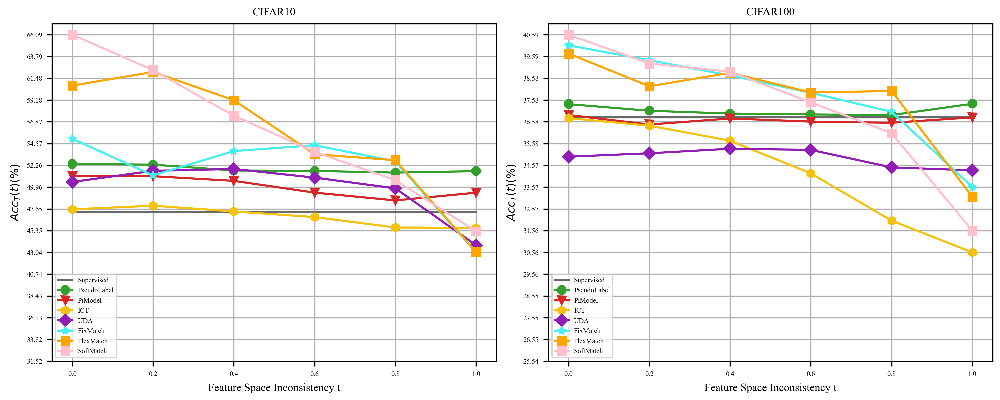

### Text Data
For text data, we used the agnews dataset. To construct an environment with inconsistent feature space, we employed text truncation. The truncated portions were filled with "<pad>".

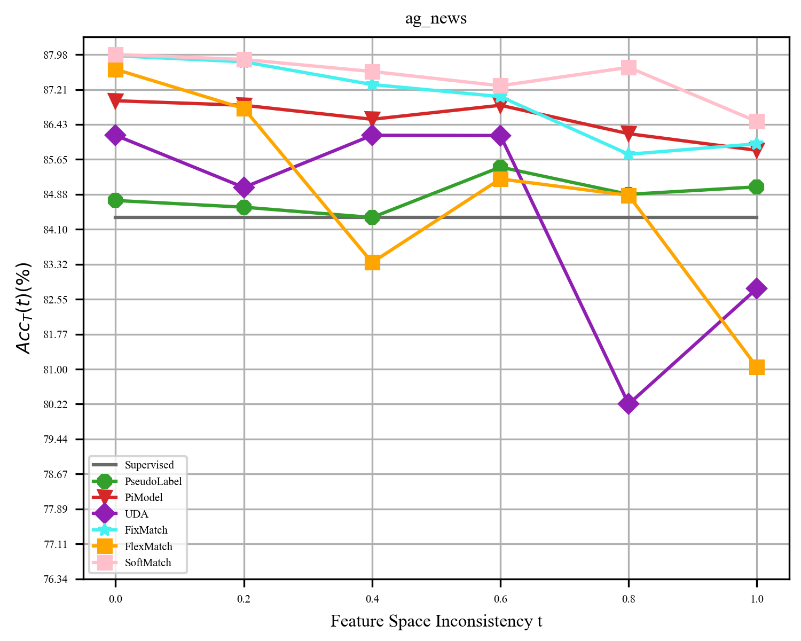

## Inconsistent Label Spaces
We set $t$ as the inconsistency rate between the labeling spaces of labeled and unlabeled data.

### Tabular Data
For tabular data, we used datasets that are consistent with the environment of inconsistent distribution. We constructed inconsistent labeled spaces environments by randomly selecting some classes and discarding the labeled data belonging to these classes. 

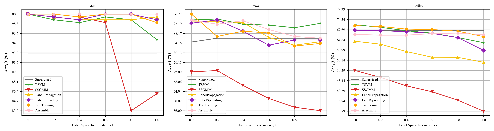

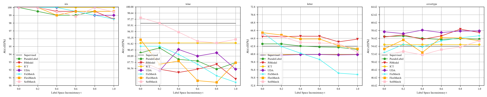

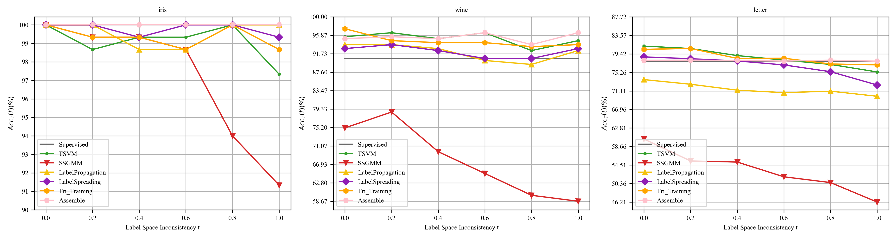

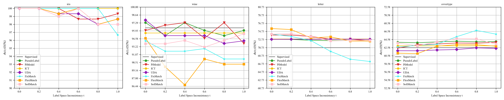

### Image Data
For image data, we used the CIFAR10 and CIFAR100 datasets. We constructed inconsistent labeled spaces environments by randomly selecting some classes and discarding the labeled data belonging to these classes.

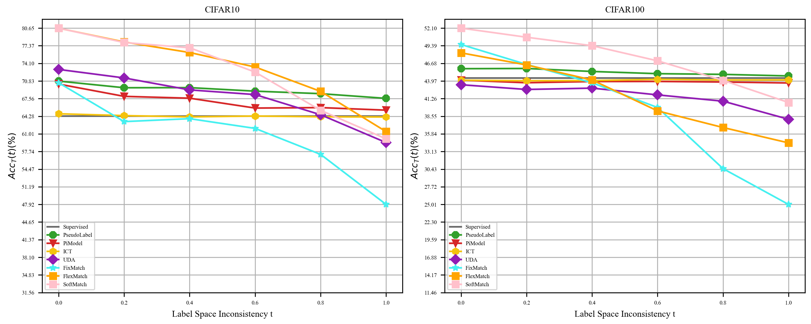

### Text Data
For text data,  we used the agnews dataset. We constructed inconsistent labeled spaces environments by randomly selecting some classes and discarding the labeled data belonging to these classes. 

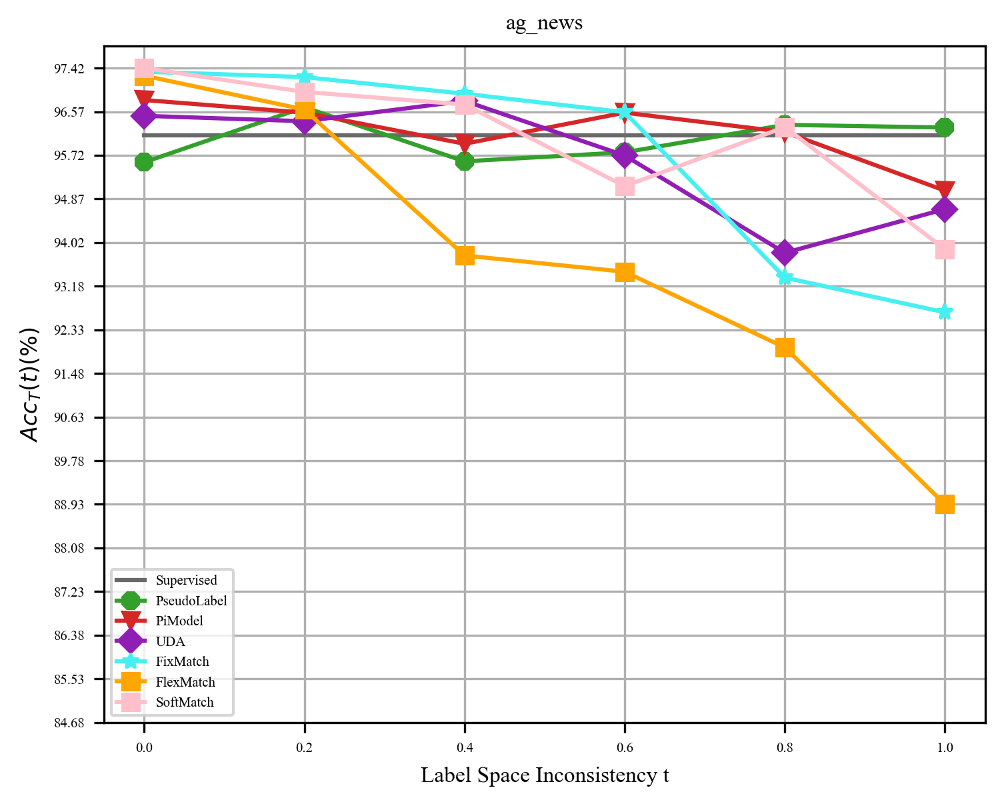

# Contribution
Feel free to contribute in any way you like, we're always open to new ideas and approaches.

- Open a discussion if you have any questions.

- Open an issue if you've spotted a bug or a performance issue.

- Fork our project and create a pull request after committing your modifications.

# Contact
If you have any questions, please contact us: Lin-Han Jia[jialh@lamda.nju.edu.cn].

