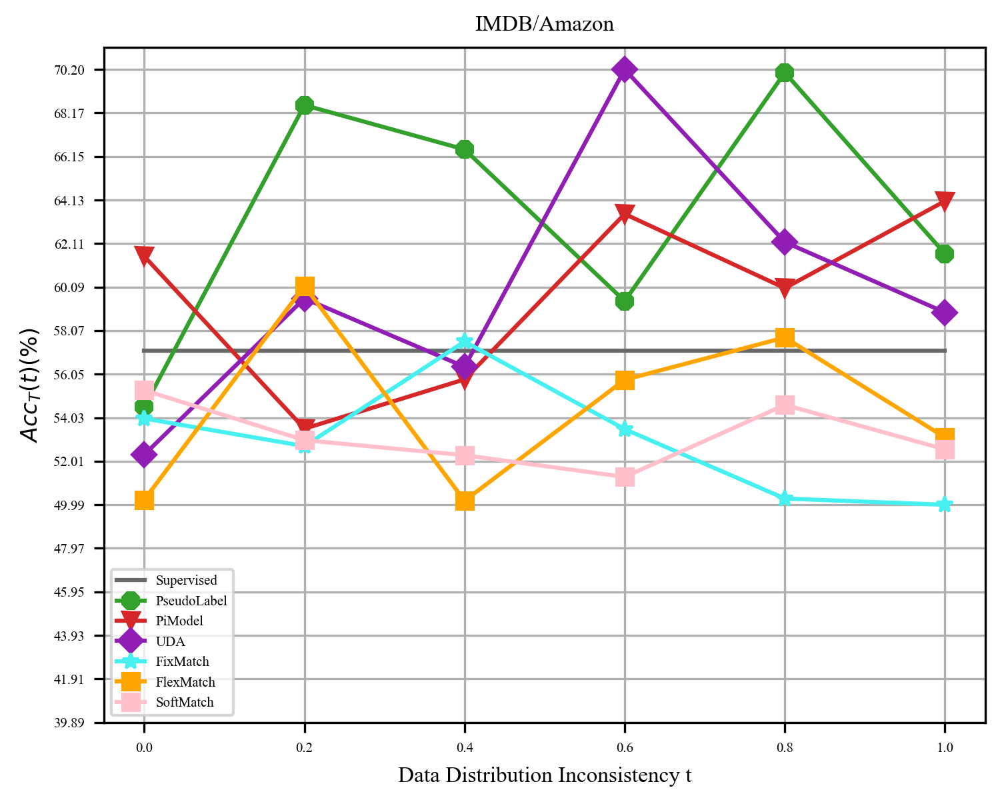

# Introduction
Classical Semi-Supervised Learning (SSL) algorithms usually only perform well when all samples come from the same distribution. To apply SSL techniques to wider applications, there is an urgent need to study robust SSL methods that do not suffer severe performance degradation when unlabeled data are inconsistent with labeled data. However, research on robust SSL is still not mature enough and in confusing. Previous research on robust SSL has approached the problem from a static perspective, thereby conflating local adaptability with global robustness from a static perspective. 

We have corrected the misconceptions in previous research on robust SSL and reshaped the research framework of robust SSL by introducing new analytical methods and associated evaluation metrics from a dynamic perspective. We build a benchmark that encompasses three types of open environments: inconsistent data distributions, inconsistent label spaces, and inconsistent feature spaces to assess the performance of widely used statistical and deep SSL algorithms with tabular, image, and text datasets. 

This benchmark is open and continuously updated. To avoid unnecessary disputes, please understand that due to limited computational resources, the current evaluation scope is limited and cannot fully represent the performance of SSL algorithms in real-world applications. We welcome everyone to contribute additional experimental setups, codes, and results to improve this benchmark.


# Analytical Method
Studying the robustness of algorithms requires a dynamic perspective to investigate the change in algorithm performance with varying degrees of data inconsistency. we denote the degree of inconsistency between labeled and unlabeled data as t and describe robustness as the overall adaptability of an algorithm or model to all degrees of inconsistency t. We denote the function that describes the change in model accuracy with inconsistency as $Acc_T$. We plot the function $Acc_T(t)$ and refer to it as the Robustness Analysis Curve (RAC), which is used to analyze the robustness of performance with respect to the changes in the degree of inconsistency t. The RAC represents the correspondence between the inconsistency $t$ on the horizontal axis and the corresponding $Acc_T(t)$ on the vertical axis. For example:


# Metrics
In order to provide a more comprehensive evaluation of SSL algorithms, we have defined multiple evaluation metrics to assess the robustness of these algorithms as unlabeled data varies. Unlike previous classical SSL evaluations that only assess $Acc_T(0)$ and previous robust SSL evaluations that only assess $Acc_T(t)$ for a specific t, our established evaluation framework based on RAC can reflect the global robustness.

- Area Under the Curve (AUC): RAC represents the performance variation with the degree of inconsistency. Therefore, the area under RAC reflects the overall performance of an algorithm or model under different degrees of inconsistency, considering each level of inconsistency equally important.

$$AUC(Acc_T) =\int_0^1 Acc_T(t)dt$$

- Expected Accuracy (EA): In many scenarios, due to the varying probabilities of different inconsistency levels t, we cannot assume that different t values are equally important. Therefore, we extend the AUC to the expected accuracy when t follows a distribution $P_T(t)$. EA is equivalent to the inner product of functions $Acc_T$ and $P_T$.AUC is a special case of EA

$$EA(P_T,Acc_T) = \langle P_T,Acc_T\rangle=\int_0^1 P_T(t)Acc_T(t)dt$$

- Worst-case Accuracy (WA): In robust SSL, we aim for the model to perform reasonably well even in the worst-case scenarios. This can be seen as a maximization of the minimum performance, which leads us to define WA to reflect the algorithm's performance under the worst conditions.

$$WA(Acc_T)=\min_{t\in[0,1]} Acc_T(t)$$

- Expected Variation Magnitude (EVM): In robust SSL, we aim for algorithms to maintain relatively stable performance across different levels of inconsistency. Therefore, we define EVM to measure the average magnitude of performance changes. This metric helps assess the average change in algorithm performance across varying levels of inconsistency. In the formula, $Acc_T'$ represents the derivative of $Acc_T$.

$$EVM(Acc_T) =\int_0^1 |Acc_T'(t)|dt$$

- Variation Stability (VS): To measure the stability of change in performance, we define VS to assess how steadily the accuracy changes with $t$. VS, in fact, is the variance of the first derivative of $ACC_T$. The higher the VS, the more random the trend of change.

$$VS(Acc_T)=\int_0^1 [Acc_T'(t)-(\int_0^1Acc_T'(t)dt)]^2dt$$

- Robust Correlation Coefficient (RCC): We not only pay attention to the magnitude of performance changes with inconsistency but also care about the direction of these changes. To address this, we define a metric called RCC, which represents the Pearson Correlation Coefficient  between accuracy and inconsistency $t$.

$$RCC(Acc_T)=\frac{\int_0^1 Acc_T(t)\cdot t dt - \int_0^1 Acc_T(t) dt}{\sqrt{\int_0^1 t^2dt -1}\cdot\sqrt{\int_0^1 Acc_T^2(t)dt-(\int_0^1 Acc_T(t) dt)^2}}$$

Overall, in open environments, we analyze RAC to reflect the performance of an algorithm or model as the inconsistency between unlabeled and labeled data changes. EA and its special case AUC reflect the overall performance. WA reflects the worst-case performance. EVM reflects the magnitude of performance variation. VS reflects the stability of the performance variation. RCC reflects the overall trend of performance variation. These metrics are all defined based on accuracy and can be extended to other different metrics by replacing the function $Acc_T$ and following the same procedure of plotting the curve and calculating the metrics according to the respective formulas.

# Installation
You can create the environment directly by anaconda.

```
conda env create -f environment.yaml
```

You can install the Benchmark by git.

```
https://github.com/YGZWQZD/Robust-SSL-Benchmark.git
```

# Algorithms Used for Evaluation

The used algorithms are continuously updating.

## Statistical Semi-Supervised Learning Algorithms

- Semi-Supervised Gaussian Mixture Model (SSGMM)

- TSVM

- Label Propagation

- Label Spreading

- Tri-Training

- Assemble

## Deep Semi-Supervised Learning Algorithms

- Pseudo Label

- PiModel

- MeanTeacher

- ICT

- UDA

- FixMatch

- FlexMatch

- SoftMatch

## Baseline Model
For statistical learning with tabular data:

- XGBoost

For deep learning with tabular data:

- FT-Transformer

For deep learning with Image data:

- ResNet50

For deep learning with Text data:

- Roberta

# Detailed Settings
## Datasets
- Data Distributions
  - Wine, Iris, Letter, Covertype: To construct datasets with inconsistent distributions. in each class, we calculate the center of all samples and sort these samples accoring to the distance between them and the center in ascending order. The first $n_c*(1-t)$ samples are used as source domian data ,and the rest $n_c*t$ samples are used as target domain data where $n_c$ is the number of this class. 5 or 10 perclass samples of source domain data are used as labeled data and the rest are used as test data.  
  - Image-CLEF, VisDA: The Image-CLEF dataset consists of 3 domains, which can be combined into 6 source-domain to target-domain pairs. From the source-domain data, 100 samples are taken as labeled data. Half of the remaining source-domain samples are used as test data, while the other half is combined with the target-domain data to form an unlabeled dataset. The total number of unlabeled data $n_u$ is $min(0.5*(n_s-100),n_t)$ where $n_s$ is the number of samples in the source domain and $n_t$ is the number of samples in the target domain. For inconsistency rate t, the unlabeled dataset is combined with $n_u*(1-t)$ samples for the source domain and $n_u*t$ samples from the target domain.
  - IMDB-Amazon: The IMDB and Amazon dataset can be consisdered as source and target domains respectly. From the source-domain data, 100 samples are taken as labeled data. Half of the remaining source-domain samples are used as test data, while the other half is combined with the target-domain data to form an unlabeled dataset. The total number of unlabeled data $n_u$ is $min(0.5*(n_s-100),n_t)$ where $n_s$ is the number of samples in the source domain and $n_t$ is the number of samples in the target domain. For inconsistency rate t, the unlabeled dataset is combined with $n_u*(1-t)$ samples for the source domain and $n_u*t$ samples from the target domain.
- Feature Space
  - Wine, Iris, Letter, Covertype: $50%$ of all samples can be used as source domain data, and the rest are used as target domain data. 5 or 10 samples perclass of source domain data are used as labeled data and the rest are used as test data. All target domain data randomly dropping $t*d$ features are used as unlabeled data.    
  - CIFAR10, CIFAR100: $50%$ of all samples can be used as source domain data, and the rest are used as target domain data. 20 samples perclass of source domain data are used as labeled data. All target domain data are transformed to grey image by dropping 2 channels. For inconsistency rate t, the unlabeled dataset is combined with $n_u*(1-t)$ samples for the source domain and $n_u*t$ samples from the target domain.
  - Agnews: $50%$ of all samples can be used as source domain data, and the rest are used as target domain data. 100 samples of source domain are used as labeled data and 
 the rest are used as test data. 50% target domain sentences are used as IID samples and the other 50% target domain sentences which drop 50% tokens are used as OOD samples. The number of unlabeled date $n_u$ is set to $min(n_I/(1-t),n_O/t$ where $n_I$ and $n_D$ are the number of IID and OOD samples respectly. The unlabeled dataset is combined with $n_u*(1-t)$ IID and $n_u*t$ OOD samples.
- Label Space
  - Wine, Iris, Letter, Covertype: $50%$ of all samples can be used as source domain data, and the rest are used as target domain data. $(k+1)//2$  classes of source data are saved and the rest samples are dropped. 5 or 10 samples perclass of saved source domain data are used as labeled data and the rest are used as test data. The target domain samples with saved classes are used as IID samples and the target samples with dropped classes are used as OOD samples. The number of unlabeled date $n_u$ is set to $min(n_I/(1-t),n_O/t)$ where $n_I$ and $n_D$ are the number of IID and OOD samples respectly. The unlabeled dataset is combined with $n_u*(1-t)$ IID and $n_u*t$ OOD samples.
- Feature Space
  - CIFAR10, CIFAR100: $(k+1)/2$ classes of all samples are used as source domain data and the rest are used as target domain data. 20 samples per class of the source domain are used as labeled data. For inconsistency rate t, the unlabeled dataset is combined with $n_t*(1-t)$ samples for the source domain and $n_t*t$ samples from the target domain where $n_t$ is the number of target domain samples.
  - Agnews: $(k+1)/2$ classes of all samples are used as source domain data and the rest are used as target domain data. 100 samples of the source domain are used as labeled data. For inconsistency rate t, the unlabeled dataset is combined with $n_t*(1-t)$ samples for the source domain and $n_t*t$ samples from the target domain where $n_t$ is the number of target domain samples.
## Baselines
- XGBoost: the parameter of use_label_encoder is set to False, the parameter eval_metric is set to "logloss".
- FT-Transformers: the number of layers is set to 8, the dimension of tokens is set to 192, the number of heads is set to 8.
- ResNet50: the Resnet50 pre-trained on ImageNet from torchvision.models is directly used.
- Roberta: the pre-trained model "roberta-base" from transformers pakage is directly used.
## Statistical Methods
- SSGMM: the number of iterations is set to 300.
- TSVM: the parameter $C_l$ is set to 15, the parameter $C_u$ is set to 0.0001, The method to deal with multi-classification tasks is set to "one vs rest".
- Label Propagation: the hyperparameters provided by scikit-learn in default are used.
- Label Spreading: the hyperparameters provided by scikit-learn in default are used.
- Tri-Training: all the base learners are set to XGBoost classifier consistent with the baseline.  
- Assemble: the number of iterations T is set to 30, all the base learners are set to XGBoost classifier consistent with the baseline.
## Deep Methods
- Mean Teacher: the EMA decay is set to 0.999, the warmup rate of unsupervised loss $w_u$ is set to 0.4, and the ratio of unsupervised loss $\lambda_u$ is set to $\max(\frac{t}{T\cdot w},1.0)$ where t is current iteration and T is the number of iterations.
- PseudoLabel: the ratio of unsupervised loss $\lambda_u$ is set to 1.0, the threshold is set to 0.95.
- Pi Model: the ratio of unsupervised loss $\lambda_u$ is set to 1.0, the warmup rate of unsupervised loss $w_u$ is set to 0.4, and the ratio of unsupervised loss $\lambda_u$ is set to $\max(\frac{t}{T\cdot w},1.0)$ where t is current iteration and T is the number of iterations.
- FixMatch: the ratio of unsupervised loss $\lambda_u$ is set to 1.0, the threshold is set to 0.8, and the temperature of softmax is set to 0.4.
- FixMatch: the ratio of unsupervised loss $\lambda_u$ is set to 1.0, the threshold is set to 0.95, and the temperature of softmax is set to 0.5.
- FlexMatch: the ratio of unsupervised loss $\lambda_u$ is set to 1.0, the basic threshold is set to 0.95, the temperature of softmax is set to 0.5, and the threshold warmup mechanism is used.
- SoftMatch: FlexMatch: the ratio of unsupervised loss $\lambda_u$ is set to 1.0, the basic threshold is set to 0.95, the temperature of softmax is set to 0.5, and the distribution alignment mechanism is used.
## Data Augmentation
- ag_news and imdb/amazon: the weak and strong augmentations are synonyms replacement with 1 and 5 words respectively.
- wine, iris, letter, covertype: the weak and strong augmentations are Gaussian noise with 0.1 and 0.2 rates respectively.
- CIFAR10, CIFAR100, VisDA, Image-CLEF: the weak augmentation is RandomHorizontalFlip, the strong augmentation is RandAugment.
## Others
- batch size: the batch size for imdb/amazon dataset is 8, the batch size for ag_news dataset is 16, the batch size for Image-CLEF and VisDA dataset is 32, the batch size for CIFAR10 and CIFAR100 is 64, the batch size for tabular datasets is 64.
- iteration: the iteration for Image-CLEF and VisDA dataset is 2000, the iteration for tabular dataset is set to 10000, the iteration for ag_news and imdb/amazon is set to 5000, the iteration for CIFAR10 and CIFAR100 is 100000.
- optimizer: the optimizer for all datasets is SGD with learning rate 5e-4 and momentum 0.9.
- scheduler: the scheduler for all datasets is CosineWarmup with num_cycles 7/16.
# Benchmark Results
The results are continuously updating.

We plotted the RAC and performed statistical analysis on various evaluation metrics for different methods. For the plotting of the RAC curve, we sampled 6 t values [0, 0.2, 0.4, 0.6, 0.8, 1] for all open environments. To ensure reliability, we conducted three experiments for each sampling point with seed values of $0\sim2$. The average of these experiments was used to plot the curve. Linear interpolation was performed between adjacent sampling points.

## Inconsistent Data Distributions
We set $t$ as the inconsistency rate between the distributions of labeled and unlabeled data. 

### Tabular Data
For tabular data, we evaluated all statistical SSL algorithms and deep SSL algorithms on the iris, wine, and letter datasets. Additionally, we evaluated all deep SSL algorithms on the larger dataset covertype. We calculated the centroids of each class in the data and used the distance between samples and class centroids to filter samples, thus constructing an environment with inconsistent data distribution. 


### Image Data
For image data, we directly used the Image-CLEF and VisDA datasets, which are commonly used in the field of transfer learning, to create environments with disparate distributions.


### Text Data
For text data, we utilized the Amazon reviews and IMDB movie reviews datasets, which have different distributions in sentiment classification, to construct environments with inconsistent distributions.



## Inconsistent Feature Spaces
We set $t$ as the inconsistency rate between the feature spaces of labeled and unlabeled data.

### Tabular Data
For tabular data, we used datasets that are consistent with the environment of inconsistent distribution. However, we introduced feature space inconsistency by randomly masking features. Each masked portion was filled with the mean value of the labeled data.


### Image Data
For image data, we used the CIFAR10 and CIFAR100 datasets. To create an environment with inconsistent feature space, we converted the images to grayscale, resulting in the loss of two color channels. The missing channels were filled with the preserved channel.


### Text Data
For text data, we used the agnews dataset. To construct an environment with inconsistent feature space, we employed text truncation. The truncated portions were filled with "<pad>".


## Inconsistent Label Spaces
We set $t$ as the inconsistency rate between the labeling spaces of labeled and unlabeled data.

### Tabular Data
For tabular data, we used datasets that are consistent with the environment of inconsistent distribution. We constructed inconsistent labeled spaces environments by randomly selecting some classes and discarding the labeled data belonging to these classes. 


### Image Data
For image data, we used the CIFAR10 and CIFAR100 datasets. We constructed inconsistent labeled spaces environments by randomly selecting some classes and discarding the labeled data belonging to these classes.


### Text Data
For text data,  we used the agnews dataset. We constructed inconsistent labeled spaces environments by randomly selecting some classes and discarding the labeled data belonging to these classes. 


# Contribution
Feel free to contribute in any way you like, we're always open to new ideas and approaches.

- Open a discussion if you have any questions.

- Open an issue if you've spotted a bug or a performance issue.

- Fork our project and create a pull request after committing your modifications.

# Contact
If you have any questions, please contact us: Lin-Han Jia[jialh@lamda.nju.edu.cn].

